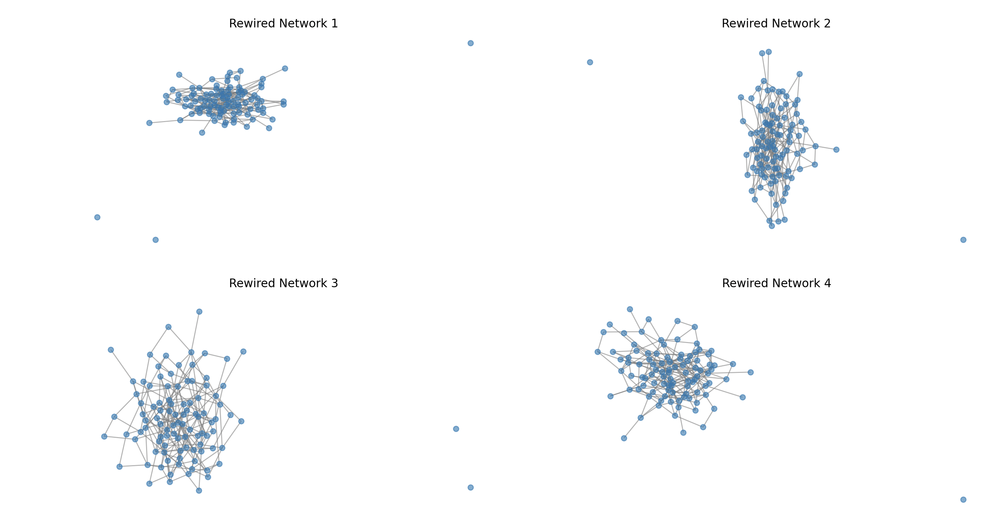

# Social Network Analysis

## Overview

This project explores various types of social network structures using NetworkX and Matplotlib. It consists of three main components:

1. **Clustered Social Network**: Generates a social network with multiple clusters, where intra-cluster connections are stronger than inter-cluster connections.
2. **Random Graph Rewiring**: Demonstrates how edges in a network can be rewired with a given probability to study the effects of randomness on structure.
3. **Random Degree Distribution Network**: Generates a graph with a given degree distribution and allows for rewiring to simulate different network dynamics.

## Dependencies

Ensure you have the following Python libraries installed:

```bash
pip install networkx matplotlib numpy
```

## 1. Clustered Social Network

This script generates a social network with distinct clusters. Nodes within a cluster have a higher chance of being connected than nodes between clusters. The method used is similar to the Girvan-Newman structure.

### Output

- A visualization of a clustered social network.


## 2. Random Graph Rewiring

This script starts with a randomly generated Erdős–Rényi graph and rewires its edges based on a given probability. This demonstrates how a network can transition from structured to more randomized connectivity.

### Output

- Four different rewired versions of the original graph displayed in a 2x2 subplot.



## 3. Random Degree Distribution Network

This script generates a network where nodes follow a predefined degree distribution using the Configuration Model. The sum of degrees is adjusted to ensure a valid network.

### Output

- A network visualization based on the generated degree sequence.
- Four rewired versions of this graph to illustrate changes in topology.


## Visualization Results

- The images produced by each of the three scripts are saved and can be used for analysis and presentation.

## Usage

Run each script separately to generate and visualize the respective networks. Modify parameters such as `p_in`, `p_out`, and `p` to observe different behaviors in network structures.

## Authors & Contributions

- **Developer**: Ali Alahyrlou
- **Visualization**: Generated using Matplotlib and NetworkX
